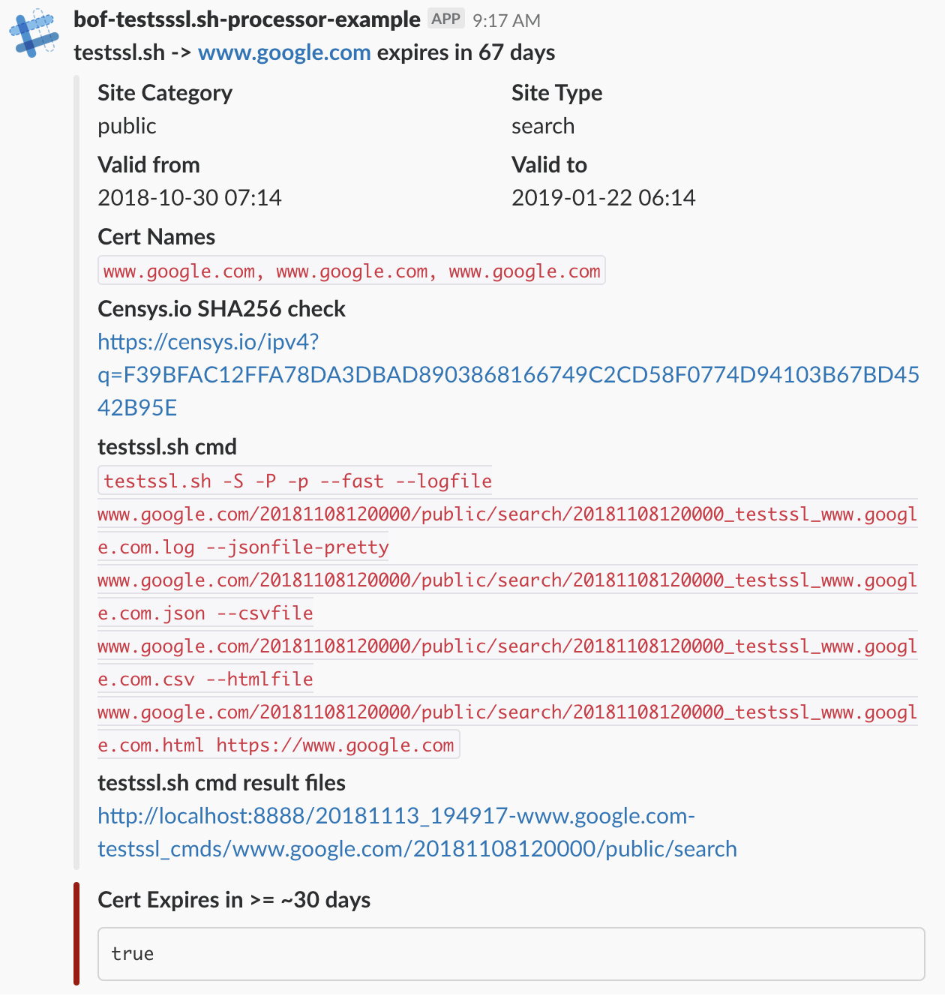
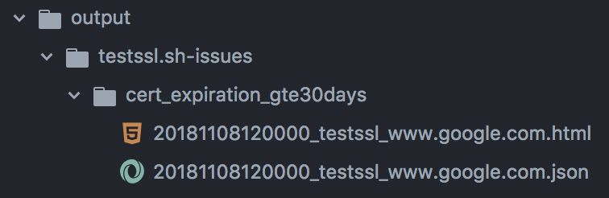

# testssl.sh-alerts

Provides a daemon that monitors for new [testssl.sh JSON result output files](https://github.com/drwetter/testssl.sh), evaluates them using [ObjectPath expressions](http://objectpath.org/) to trigger events which can be reacted to in different ways such as sending Slack alerts, copying JSON result files to a new location or anything else you with do do. You can implement a simple python `Reactor` with a `handleTriggers` method and do whatever you want to extend the available functionality.


# Requirements

**Python 3.6**

Dependencies:
```
pip install objectpath pyyaml python-dateutil watchdog slackclient pygrok jinja2
```

# Overview and Configuration

The handler engine is configured by one or more YAML configuration documents
([see example here](example-config.yaml)) that can be dropped in the `--config-dir`.
Each `testssl.sh` JSON result file detected will be processed against every YAML config
file loaded into the system and there is no limit to the number of config files.

Each config file configures the handler engine for each JSON result file to be processed.
The handler engine makes heavy use of [ObjectPath expressions](http://objectpath.org/)
to craft an `evaluation_doc` which is comprised of the original `testssl.sh` JSON result
document/object contents plus addition meta-data that can be extracted from the result file path
via Grok ([via PyGrok](https://github.com/garyelephant/pygrok)) expressions and permitting full customization of the resulting meta-data and `evaluation_doc` structure and property names.

Once this `evaluation_doc` is constructed the config file's `trigger_on` triggers are
evaluated one by one against the `evaluation_doc`. Each trigger is comprised of a `title`,
an [ObjectPath](http://objectpath.org/) expression, and the names of one or more `reactors`
that should be invoked if the [ObjectPath](http://objectpath.org/) expression returns a value.
If the value is a `Boolean` it must be `True` for the for trigger to be considered "fired". Any
other value returned by an expression other than `None` also qualifies as the trigger being fired.

For each fired trigger it will be passed to its configured `reactor`. There are two provided
reactors:

* **SlackReactor**: [slackreactor.py](reactors/slackreactor.py) - Sends Slack alerts using a jinja2 template, see [example-config.yaml](example-config.yaml) for details
* **CopyFileReactor**: [copyfilereactor.py](reactors/copyfilereactor.py) - Copies files. For example to copy the testssl.sh JSON files that container certain vulnerabilities, see [example-config.yaml](example-config.yaml) for details


# Configution details

For full configuration details its best to see the ([see example here](example-config.yaml))
in [example-config.yaml](example-config.yaml)


## Usage

```
./testssl_result_handler.py --help

usage: testssl_result_handler.py [-h] [-i INPUT_DIR]
                                 [-f INPUT_FILENAME_FILTER] [-I CONFIG_DIR]
                                 [-l LOG_FILE] [-x LOG_LEVEL]
                                 [-w INPUT_DIR_WATCHDOG_THREADS]
                                 [-s INPUT_DIR_SLEEP_SECONDS]
                                 [-d DEBUG_OBJECTPATH_EXPR] [-D] [-E]

optional arguments:
  -h, --help            show this help message and exit
  -i INPUT_DIR, --input-dir INPUT_DIR
                        Directory path to recursively monitor for new `*.json`
                        testssl.sh result files. Default './input'
  -f INPUT_FILENAME_FILTER, --input-filename-filter INPUT_FILENAME_FILTER
                        Regex for filter --input-dir files from triggering the
                        watchdog. Default '.*testssloutput.+.json'
  -I CONFIG_DIR, --config-dir CONFIG_DIR
                        Directory path to recursively monitor for new `*.yaml`
                        result handler config files. Default './configs'
  -l LOG_FILE, --log-file LOG_FILE
                        Path to log file, default None, STDOUT
  -x LOG_LEVEL, --log-level LOG_LEVEL
                        log level, default DEBUG
  -w INPUT_DIR_WATCHDOG_THREADS, --input-dir-watchdog-threads INPUT_DIR_WATCHDOG_THREADS
                        max threads for watchdog input-dir file processing,
                        default 10
  -s INPUT_DIR_SLEEP_SECONDS, --input-dir-sleep-seconds INPUT_DIR_SLEEP_SECONDS
                        When a new *.json file is detected in --input-dir, how
                        many seconds to wait before processing to allow
                        testssl.sh to finish writing. Default 5
  -d DEBUG_OBJECTPATH_EXPR, --debug-object-path-expr DEBUG_OBJECTPATH_EXPR
                        Default False. When True, adds more details on
                        ObjectPath expression parsing to logs
  -D, --debug-dump-evaldoc
                        Flag to enable dumping the 'evaluation_doc' to STDOUT
                        after it is constructed for evaluations (WARNING: this
                        is large & json pretty printed)
  -E, --dump-evaldoc-on-error
                        Flag to enable dumping the 'evaluation_doc' to STDOUT
                        (json pretty printed) on any error (WARNING: this is
                        large & json pretty printed)
```

# Example

Lets startup the result handler:

```
mkdir input/
mkdir configs/
mkdir output/

./testssl_result_handler.py \
  --debug-object-path-expr True \
  --input-dir ./input \
  --config-dir ./configs \
  --input-filename-filter '.*_testssl_.+.json'
```

At this point the handler is up and running....

```
2018-11-13 21:10:15,144 - root - INFO - Monitoring for new result handler config YAML files at: ./configs
2018-11-13 21:10:15,146 - root - INFO - Monitoring for new testssl.sh result JSON files at: ./input
...
```

Lets copy a sample config to `configs/`

```
cp example-config.yaml configs/
```

Which is then consumed by the handler...

```
...
2018-11-13 21:10:19,248 - root - INFO - Responding to creation of result handler config file: ./configs/example-config.yaml
...
```

At this point the handler watchdog is monitoring `input/` for any `.*testssl.+.json` files.
Lets copy some sample output generated by the [testssl.sh-processor](https://github.com/bitsofinfo/testssl.sh-processor)
project's example output found in the `sample/` directory.

```
cp -R sample/* input/
```

Once detected by the watchdog the result handler begins to react, since the `cert_expiration_gte30days` trigger fires, we send both a slack alert and copy the JSON result file to the given path as specified in the config's `reactor_engine` settings contained within `example-config.yaml`

```
2018-11-13 21:10:27,895 - root - INFO - Responding to parsable testssl.sh JSON result: ./input/20181113_194917-www.google.com-testssl_cmds/www.google.com/20181108120000/public/search/20181108120000_testssl_www.google.com.json
2018-11-13 21:10:27,896 - root - INFO - Received event for create of new testssl.sh JSON result file: './input/20181113_194917-www.google.com-testssl_cmds/www.google.com/20181108120000/public/search/20181108120000_testssl_www.google.com.json'
2018-11-13 21:10:27,897 - root - INFO - testssl.sh JSON result file loaded OK: './input/20181113_194917-www.google.com-testssl_cmds/www.google.com/20181108120000/public/search/20181108120000_testssl_www.google.com.json'
2018-11-13 21:10:27,897 - root - INFO - Evaluating ./input/20181113_194917-www.google.com-testssl_cmds/www.google.com/20181108120000/public/search/20181108120000_testssl_www.google.com.json against config 'example-config.yaml' ...
2018-11-13 21:10:27,913 - root - DEBUG - exec_objectpath: query: $.testssl_result.scanResult[0].serverDefaults[split(@.id,' ')[0] is 'cert_notAfter'][@.finding]
2018-11-13 21:10:27,920 - root - DEBUG - exec_objectpath: query: $.testssl_result.scanResult[0].serverDefaults[split(@.id,' ')[0] is 'cert_notAfter'][@.finding] raw result type(): <class 'generator'>
...
2018-11-13 21:10:28,177 - root - DEBUG - Invoking reactor: slack for 1 fired triggers
...
2018-11-13 21:10:28,196 - root - DEBUG - SlackReactor: Sending to slack....
2018-11-13 21:10:28,205 - urllib3.connectionpool - DEBUG - Starting new HTTPS connection (1): hooks.slack.com
2018-11-13 21:10:29,072 - urllib3.connectionpool - DEBUG - https://hooks.slack.com:443 "POST /services/TE2KJDF4L/BE22XTKGQ/4UKdwVZQ54U1NW8p7mtdowfN HTTP/1.1" 200 22
2018-11-13 21:10:29,083 - root - DEBUG - Invoking reactor: copy_testssl_issues for 1 fired triggers
2018-11-13 21:10:29,087 - root - INFO - CopyFileReactor: Copied OK /Users/inter0p/Documents/omg/code/github.com/bitsofinfo/testssl.sh-alerts/input/20181113_194917-www.google.com-testssl_cmds/www.google.com/20181108120000/public/search/20181108120000_testssl_www.google.com.json TO output/testssl.sh-issues/cert_expiration_gte30days/20181108120000_search_20181108120000_testssl_www.google.com.json
```

Result of `SlackReactor` alert:


Result of `CopyFileReactor`:



# Docker

The dockerfile contained in this project can easily be built locally and run easily
via the command line just like via the shell directly.

```
docker build -t testssl-alerts .

docker run \
  -v /path/to/configs:/configs \
  -v /path/to/output:/input \
  testssl-alerts \
  testssl_result_handler.py \
    --input-dir /input \
    --config-dir /configs
```

## Creating your own Reactors

Its pretty easy to create your own custom reactor.

1. Create a new class at `reactors/myreactor.py` and declare a class in it called `MyReactor`

2. Declare it and its configuration under `reactor_engines`. You can have different reactors that all
leverage the same reactor `class_name` but behave differently. Triggers reference the arbitrary `reactor-name`
which can be any valid yaml key name.

```
reactor_engines:
  [reactor-name]:
    class_name: "MyReactor"
    ...
    ...
```

2. It should support a constructor and declared the named method as follows:
```
...

# Constructor
# passed the raw reactor_config object
def __init__(self, reactor_config):
    self.my_prop = reactor_config['my_prop']


# When invoked this is passed
#
# - 'triggers_fired' - array of trigger_result objects.
#                      Where each trigge_result is defined as:
# {
#    'tag': [short name of the trigger]
#    'title':[see above, title of the trigger name],
#    'reactors':[see above, array of configured reactor names],
#    'objectpath':[see above, the objectpath],
#    'results':[array of raw object path result values],
#    'config_filename':[name of the YAML config the trigger was defined in],
#    'testssl_json_result_abs_file_path':[absolute path to the testssl.sh JSON result file],
#    'testssl_json_result_filename':[filename only of JSON result file],
#    'evaluation_doc':[the evalution_doc object that the trigger evaluated]
#  }
#
#
# - 'objectpath_ctx' - a reference to the ObjectPathContext object used
#                      when processing the trigger evaluations. The following
#                      ObjectPathContext properties can be used in the reactor
#                      for further ObjectPath based functionality if the reactor
#                      plugin wishes to take advantage of it.
# {
#    exec_objectpath: ObjectPathContext function reference
#    exec_objectpath_specific_match: ObjectPathContext function reference
#    exec_objectpath_first_match: ObjectPathContext function reference
#    evaluation_doc: the raw evalution_doc object that the trigger evaluated
#  }
#
#
def handleTriggers(self, triggers_fired, objectpath_ctx):
  ...
  DO YOUR WORK HERE!
  ...
```


## Related

* This tool was originally developed as the 3rd stage in a pipeline of `testssl.sh` automation, consuming the `testssl.sh` JSON output files produced by the [testssl.sh-processor daemon](https://github.com/bitsofinfo/testssl.sh-processor) available at https://github.com/bitsofinfo/testssl.sh-processor which is a tool to bulk test `testssl.sh` command files generated by another process, using a file monitoring watchdog.
